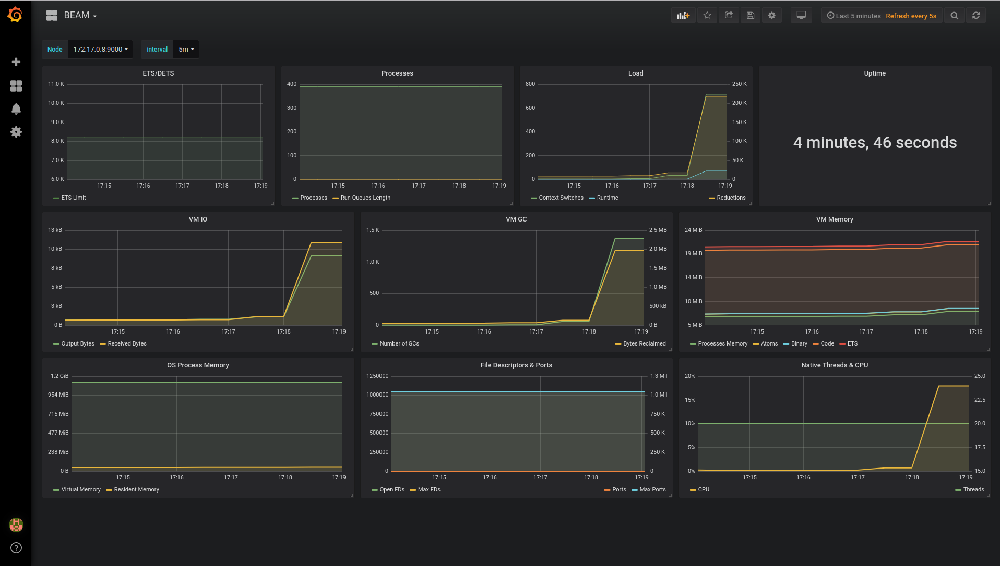

# Using Minikube, Erlang and Prometheus

This is a quick demo of using minikube to run an Erlang node with prometheus and grafana.
The example we will use is the
[Docker Watch](http://github.com/erlang/docker-erlang-example/tree/master) node.
This demo assumes that you have done the
[Using Minikube](http://github.com/erlang/docker-erlang-example/tree/minikube-simple) demo.

This is only meant to be an example of how to get started. It is not the only,
nor neccesarily the best way to setup minikube with Erlang.

# Prerequisites

To start with you should familiarize yourself with minikube through this guide:
https://kubernetes.io/docs/setup/minikube/

In a nutshell:

## Install

 * [VirtualBox](https://www.virtualbox.org/wiki/Downloads)
 * [kubectl](https://kubernetes.io/docs/tasks/tools/install-kubectl/)
 * [minikube](https://github.com/kubernetes/minikube/releases)

## Start and test

    > minikube start
    > kubectl run hello-minikube --image=k8s.gcr.io/echoserver:1.10 --port=8080
    > kubectl expose deployment hello-minikube --type=NodePort
    > curl $(minikube service hello-minikube --url)
    ## Should print a lot of text
    > kubectl delete services hello-minikube
    > kubectl delete deployment hello-minikube
    > minikube stop

# Deploying Dockerwatch and Prometheus

In this demo we will be doing three things:

* Extend dockerwatch with prometheus metrics support
* Create Deployments for Prometheus and Grafana
* Create a Service that will be used to access the dockerwatch API
* Create a Secret for our ssl keys
* Create a Deployment of dockerwatch that implements the Service

First however, make sure that the minikube cluster is started:

    > minikube start

and that you have cloned this repo and changed to the correct
directory:

    > git clone https://github.com/erlang/docker-erlang-example
    > cd docker-erlang-example/advanced_examples/minikube-simple

## Extend dockerwatch

In this demo we will be using the [prometheus](https://hex.pm/packages/prometheus),
[prometheus\_process\_collector](https://hex.pm/packages/prometheus_process_collector)
and [prometheus\_cowboy](https://hex.pm/packages/prometheus_cowboy) hex packages to get
the instrumentation we need. So we need to add those packages to the rebar.conf file.

```
{deps, [{jsone,  "1.4.7"},   %% JSON Encode/Decode
        {cowboy, "2.5.0"},   %% HTTP Server
        {prometheus,"4.2.0"},
        {prometheus_process_collector,"1.4.0"}
        {prometheus_cowboy,"0.1.4"}]}.
```

And also the corresponding modificaion to the app.src file:

```
{applications, [
        kernel,
        stdlib,
        jsone,
        cowboy,
        prometheus,
        prometheus_process_collector,
        prometheus_cowboy
	]},
```

We then need to add a new http endpoint that takes requests from the prometheus
server and returns the correct results. This service traditionally runs on port
9000 so we add another child to the dockerwatch supervisor.


```
PromConfig =
    #{ env => #{ dispatch =>
                     cowboy_router:compile(
                       [{'_', [{"/metrics/[:registry]", prometheus_cowboy2_handler, []}]}]) }
     },

Prometheus = ranch:child_spec(
               cowboy_prometheus, 100, ranch_tcp,
               [{port, 9000}],
               cowboy_clear,
               PromConfig),
```

We also need to add the correct instrumentation to the cowboy servers so that we
can measure things like requests per minute and the 95th percentile latency of
requests. This is done by modifying the cowboy config to include a metric_callback
and two stream handlers.

```
CowConfig = #{ env => #{ dispatch => Dispatch },
               metrics_callback => fun prometheus_cowboy2_instrumenter:observe/1,
               stream_handlers => [cowboy_metrics_h, cowboy_stream_h] },
```

You can view the entire new supervisor module [here](dockerwatch/src/dockerwatch_sup.erl).

## Deploy Dockerwatch

Now we should deploy the dockerwatch service almost the same way as was done in
[Using Minikube: Simple](http://github.com/erlang/docker-erlang-example/tree/minikube-simple).
So:

```
> kubectl create service nodeport dockerwatch --tcp=8080:8080 --tcp=8443:8443
service/dockerwatch created
> ./create-certs $(minikube ip)
......
> kubectl create secret generic dockerwatch --from-file=ssl/
secret/dockerwatch created
> eval $(minikube docker-env)
> docker build -t dockerwatch .
```

We will have to modify the deployment somewhat from the original example:

```
cat <<EOF | kubectl apply -f -
apiVersion: apps/v1
kind: Deployment
metadata:
  ## Name and labels of the Deployment
  labels:
    app: dockerwatch
  name: dockerwatch
spec:
  replicas: 1
  selector:
    matchLabels:
      app: dockerwatch
  template:
    metadata:
      labels:
        app: dockerwatch
      annotations: ## These annotations will tell prometheus to scrape us
        prometheus.io/scrape: "true"
        prometheus.io/port: "9000"
    spec:
      containers:
      ## The container to launch
      - image: dockerwatch
        name: dockerwatch
        imagePullPolicy: Never
        ports:
        - containerPort: 8080
          protocol: TCP
        - containerPort: 8443
          protocol: TCP
        - containerPort: 9000 ## Expose the prometheus port
          protocol: TCP
        volumeMounts:
            - name: kube-keypair
              readOnly: true
              mountPath: /etc/ssl/certs
      volumes:
        - name: kube-keypair
          secret:
            secretName: dockerwatch
EOF
```

We can then setup prometheus and grafana following [the excellent example by bakins](https://github.com/bakins/minikube-prometheus-demo).

```
> kubectl apply -f monitoring-namespace.yaml
> kubectl apply -f prometheus-config.yaml
> kubectl apply -f prometheus-deployment.yaml
> kubectl apply -f prometheus-service.yaml
```

You should now be able to view the prometheus dashboard through the url given by:

    minikube service --namespace=monitoring prometheus

Then we can start Grafana:

```
> kubectl apply -f grafana-deployment.yaml
> kubectl apply -f grafana-service.yaml
```

Grafana can then be found under:

    minikube service --namespace=monitoring grafana

The username and password is `admin`. You then need to add a new prometheus datasource to grafana.
The url to prometheus within the cluster is http://prometheus.monitoring.svc.cluster.local:9090.

There are some ready made dashboards at: https://github.com/deadtrickster/beam-dashboards that
can be imported to get something quick up and running. If done correcly it could look like this:


